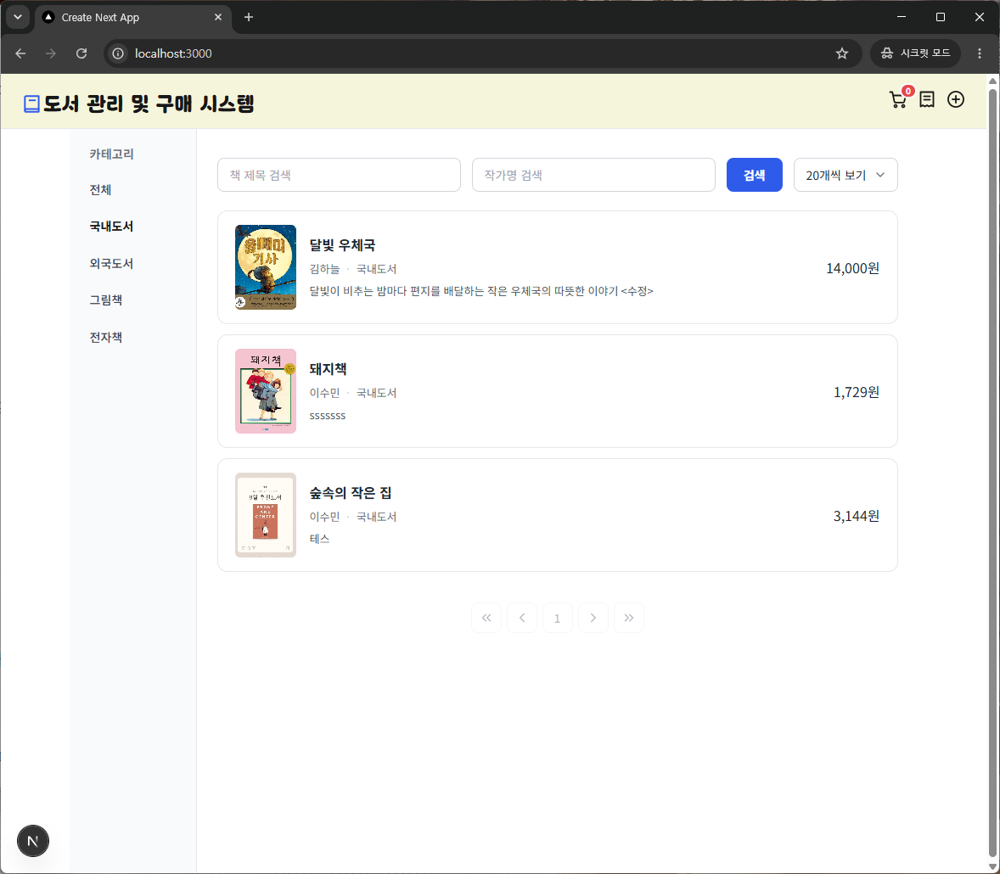
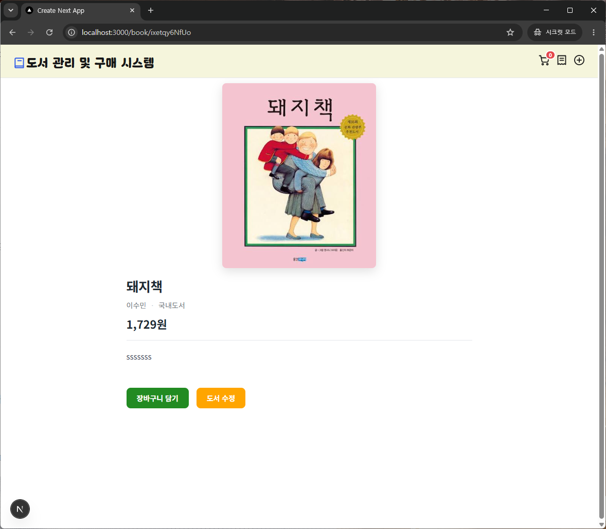
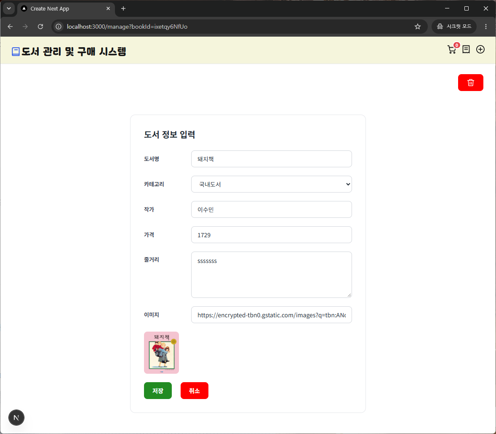
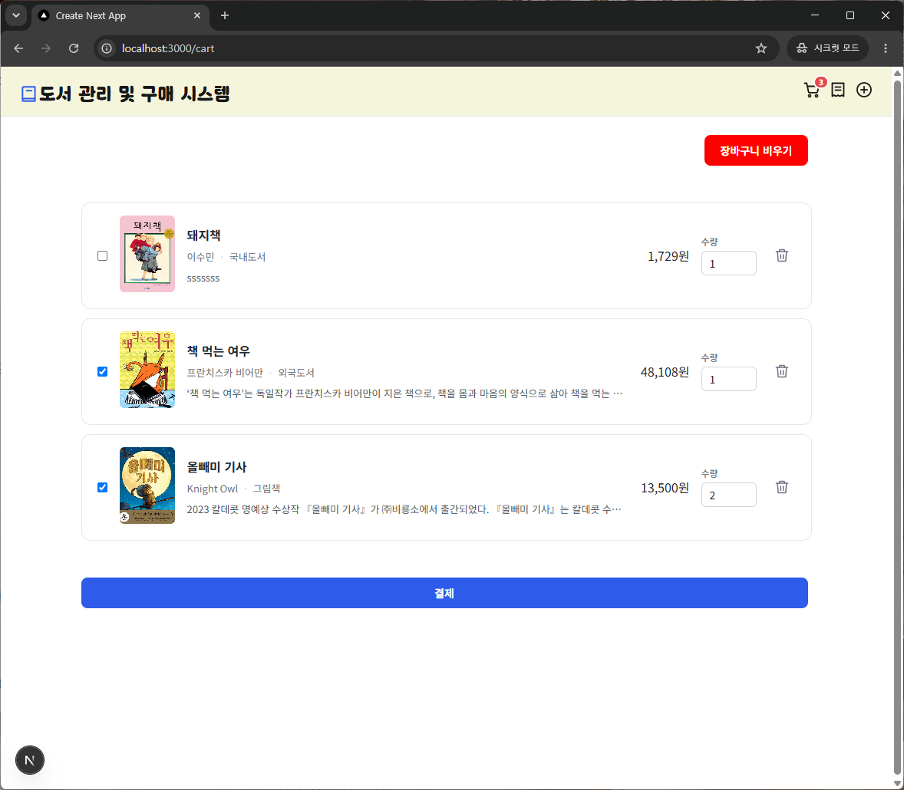
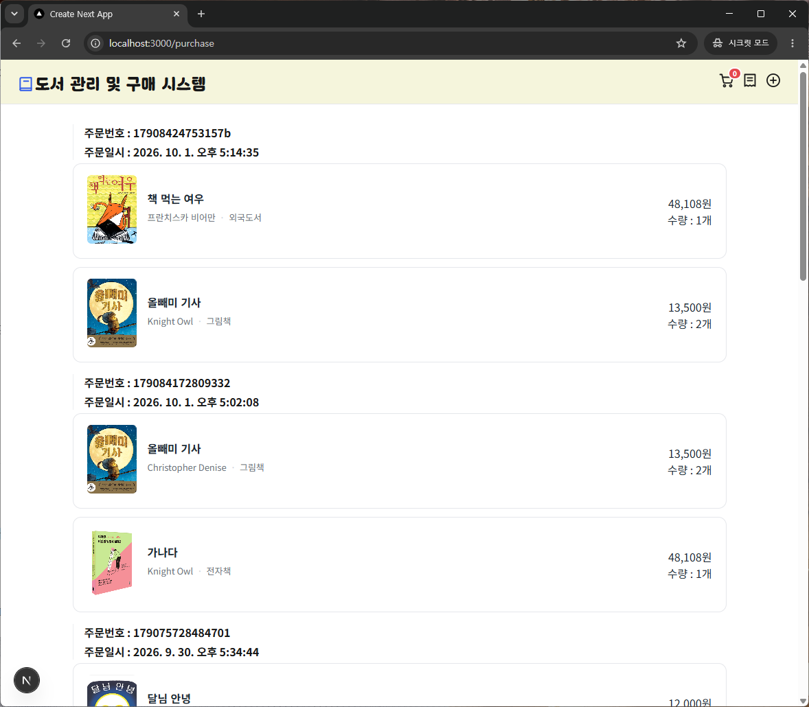

# 도서 관리 및 결제 시스템
도서 검색, 도서 관리, 장바구니에 넣고 결제할 수 있는 Next.js / React 기반 프로젝트입니다.

- 개발 기간 : 2026.09.28 ~ 2026.10.01
- 주요 사용자 : 책을 판매하고 싶은 판매자와 사고 싶은 구매자
- 제작 목적 : 온라인에 편하게 책을 등록하고 편하게 구매할 수 있게 제작하였습니다.

&nbsp;

## 주요 기능
| 기능 | 주소 | 설명 |
|---|---|---|
| 목록 조회 | `/` | 전체 도서 목록을 조회하고 검색 및 필터링이 가능합니다. |
| 상세 조회 | `/book/[id]` | 선택한 도서의 상세 정보를 확인합니다. |
| 도서 관리 | `/manage` | 새로운 도서를 등록하거나 수정합니다. |
| 장바구니 | `/cart` | 장바구니에서 수량 변경이나 결제가 가능합니다. |
| 구매 기록 | `/purchase` | 구매한 기록을 확인합니다. |

&nbsp;

## 화면 예시
 | 
---|---|

 |  | 
---|---|---|

&nbsp;

## 기술 스택
- Next.js
- React
- JavaScript
- Zustand
- JSON Server
- AI (Claude) : CSS

&nbsp;

## 설치 및 실행 방법
1. 저장소 복제
   ```bash
   git clone https://github.com/yeon-ryu/bookstore-react.git
   ```
2. 프로젝트 폴더에서 cmd 창 열기
3. 패키지 설치
   ```bash
   npm install
   ```
4. JSON Server 실행
   ```bash
   npm run server
   ```
5. Next.js 실행
   - JSON Server 와 다른 cmd 창에서 명령어 실행
   ```bash
   npm run dev
   ```

### 접속 주소
Next.js : http://localhost:3000  
JSON Server : http://localhost:4000

&nbsp;

## 구조
```
src/
├─ app/           /, /book/[bookId], /manage, /cart, /purchase
├─ components/    Layout, Header, Error, Loading, Empty, Paging, BookCard
├─ api/           bookAPI, purchaseAPI
└─ stores/        useCartStore
```

### 상태 관리
- Zustand
  - 장바구니(localStorage) : 헤더에서 보이며, 다른 페이지에서 바로 장바구니에 담는 상호작용이 필요하고 새로고침하더라도 유저의 변경사항 유지
- JSON Server
  - 도서 정보(books)
  - 결제 정보(purchase)
- 그 외의 상태는 각 페이지에서 useState 로 관리

&nbsp;

## 트러블슈팅
### useSearchParam 문제
-  문제 : npm run dev 에서는 잘 돌아갔지만 npm run build 를 실패함
- 원인 : useSearchParams 를 통해 서치 파라미터를 읽으면 전체 페이지가 클라이언트 렌더링으로 전환되어 클라이언트 JavaScript 페이지가 로드될 때까지 페이지가 비어있게 된다.
- 해결 : useSearchParams 를 사용하는 컴포넌트를 Suspense 태그로 감싸서 출력

### 중복 검색 문제
- 리스트 페이지에서 검색이 여러번 일어남
- 원인 : 페이징이 바꼈을 때, searchParam 이 바꼈을 때 검색을 하고 있었는데 카테고리/검색버튼 눌렸을 때 페이징도 바꾸다보니 처음 페이지 렌더링 될 때 중복 작업이 일어남
- 해결 : refresh 라는 state 를 만들고 검색이 일어나야하는 경우 전부 setRefresh 를 하고 refresh 가 false 에서 true 로 바꼈을 때만 검색을 하도록 변경했다. setState 는 비동기 처리여서 한꺼번에 처리되기에 중복 검색을 방지할 수 있게 되었다.

&nbsp;

## 프로젝트 회고
이번 프로젝트를 하면서 배운 기능들을 다양하게 사용해볼 수 있어서 좋았습니다.
선택 기능인 자체 탭 제작을 하다 시간이 부족하여 추가하지 않았는데, 다음에 만들 기회가 된다면 다시 도전해보고 싶습니다.